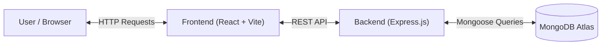

# System Architecture

## Overview

The TruEstate Sales Management System follows a standard Client-Server architecture using the MERN stack.



## Backend Architecture

The backend is built with Node.js and Express, following a layered architecture to ensure separation of concerns.

### Layer Explanation
1.  **Routes (`src/routes`):** Define the API endpoints and map them to controller functions.
2.  **Controllers (`src/controllers`):** Handle the incoming HTTP requests, extract parameters (query, body), and send valid responses.
3.  **Services (`src/services`):** Contain the business logic. This layer interacts with the database models and performs data processing.
4.  **Database (`src/models`):** Mongoose schemas defining the data structure and validation.

### MongoDB Atlas Connection
*   We use **Mongoose** to manage the connection to MongoDB Atlas.
*   Connection pooling is handled automatically by the driver.
*   The `connectDB` utility ensures the app fails fast if the database connection cannot be established.

### Query Building Strategy
We use a dynamic query builder utility (`src/utils/queryBuilder.js`) that constructs a MongoDB query object based on active filters:
*   **Multi-Selects:** Converted to `$in` arrays.
*   **Ranges:** Converted to `$gte` and `$lte` operators.
*   **Search:** Converted to `$regex` for partial matching (case-insensitive).

### API Endpoints

#### `GET /api/sales`
Fetches a paginated list of sales records.
*   **Query Parameters:**
    *   `page`: Page number (default: 1)
    *   `limit`: Items per page (default: 10)
    *   `search`: Search term for Name/Phone
    *   `sortBy`: Field to sort by (`date`, `quantity`, `customer_name`)
    *   `regions`, `gender`, `categories`, `tags`, `paymentMethods`: Comma-separated lists for filtering.
    *   `dateFrom`, `dateTo`: Date range filters.
    *   `ageMin`, `ageMax`: Age range filters.

#### `GET /api/sales/filters`
Returns all unique values available in the database for dynamic filter generation (e.g., all unique Regions, Categories).

#### `GET /api/health`
Simple health check endpoint to verify server status.

### Database Schema (Sale Model)
The schema is designed for read-heavy operations.
*   **Indexes:**
    *   `text` index on `customer_name` and `phone_number` for search performance.
    *   Single field indexes on `customer_region`, `product_category`, `date`, and `payment_method` to optimize filtering.

### Aggregation Pipeline
Statistics (Total Units, Total Amount, Total Discount) are calculated using MongoDB's Aggregation Framework (`Sale.aggregate`). This runs in parallel with the main data fetch request to ensure performance (`Promise.all`).

---

## Frontend Architecture

The frontend is a Single Page Application (SPA) built with React and Vite.

### Component Hierarchy
```
App.jsx
├── Sidebar (Navigation)
├── Header (Search & Title)
├── FilterRow (Filter Controls)
├── StatsCards (Key Metrics)
└── SalesTable (Data Display)
    ├── HeaderCell (Sticky Headers)
    └── Cell (Data Rows)
```

### State Management
We use the **Context API** (`DataContext.jsx`) to manage global state:
*   `filters`: Object storing current filter selections.
*   `pagination`: Current page and limit.
*   `sorting`: Current sort field and order.

This allows deeply nested components (like `FilterRow` or `Pagination`) to update the state without prop drilling.

### Data Fetching
A custom hook `useSalesData` encapsulates the fetch logic:
*   It watches for changes in `filters`, `sorting`, or `pagination`.
*   It debounces requests (300ms) to prevent excessive API calls during typing.
*   It handles loading and error states.

### Data Flow
1.  **Interaction:** User types a search term or selects a filter.
2.  **Context Update:** `DataContext` updates the state variables.
3.  **Trigger:** `useSalesData` detects the dependency change.
4.  **API Call:** `axios` sends a request to the backend with the new query parameters.
5.  **Processing:** Backend processes the query and returns JSON.
6.  **UI Update:** React re-renders the `SalesTable` and `StatsCards` with new data.

---

## Design Decisions

### Why MongoDB?
*   **Flexible Schema:** Allows for easy iteration on data fields (like adding new operational metrics) without complex migrations.
*   **Performance:** MongoDB is highly optimized for read-heavy workloads and aggregation queries used in analytics.

### Why Context API over Redux?
*   **Simplicity:** The application state (filters, sorting, view data) is moderately complex but doesn't require the boilerplate of Redux. Context API + Hooks provides a cleaner, more lightweight solution.

### Why Vite?
*   **Speed:** fast HMR (Hot Module Replacement) and optimized build times compared to Create React App (CRA).

---

## Performance Considerations

1.  **Database Indexes:** Critical for keeping search and filter queries fast as the dataset grows (tested with 100k+ records).
2.  **Parallel Execution:** The backend fetches sales data, count, and statistics in parallel (`Promise.all`) to reduce response time.
3.  **Debouncing:** Frontend search input is debounced to avoid flooding the server with requests while the user types.
4.  **Lean Queries:** Using `.lean()` in Mongoose to return plain JavaScript objects instead of heavy Mongoose Documents, reducing memory usage and serialization overhead.
